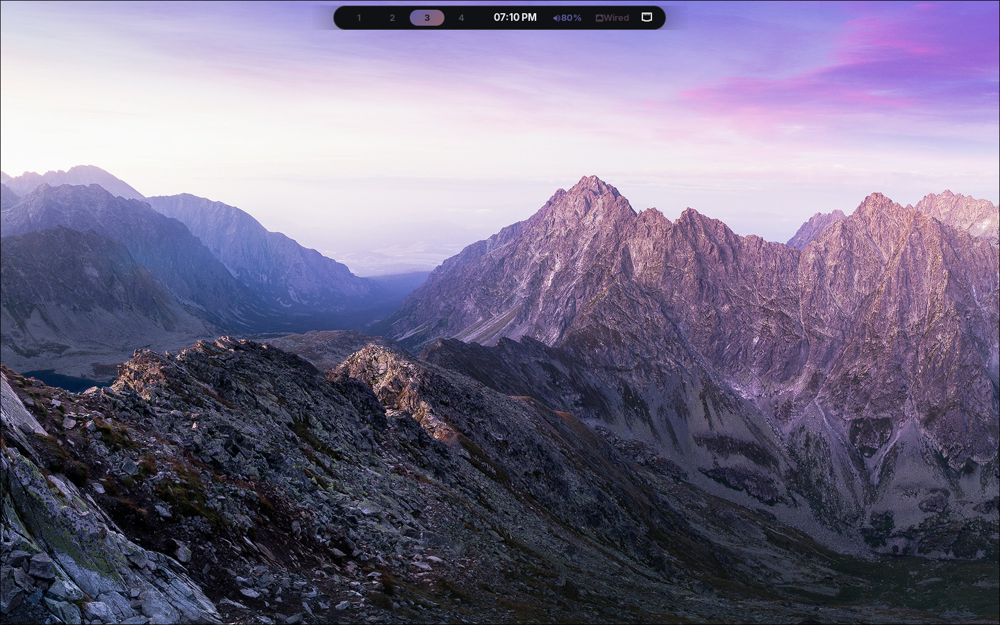
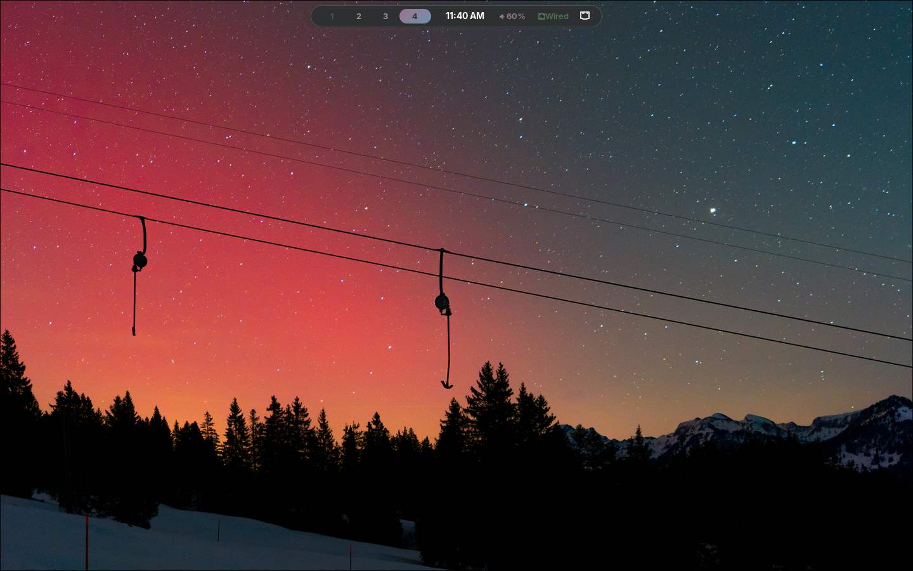
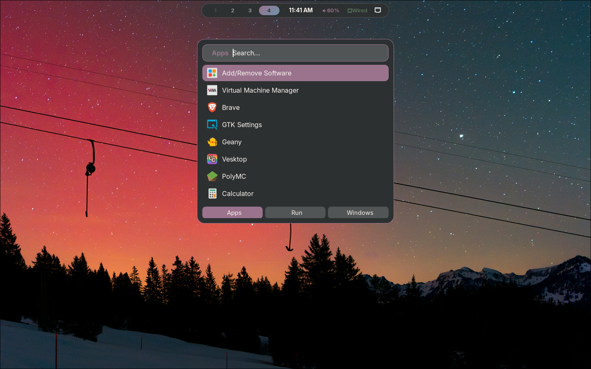
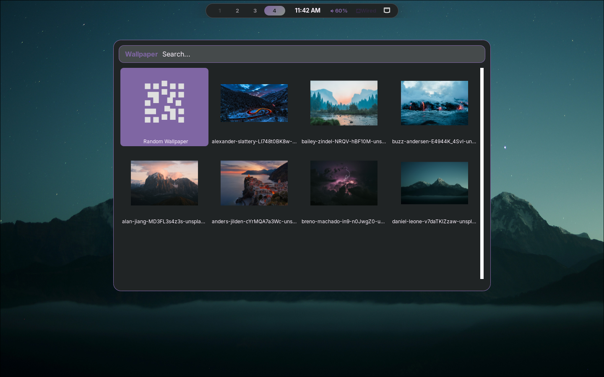
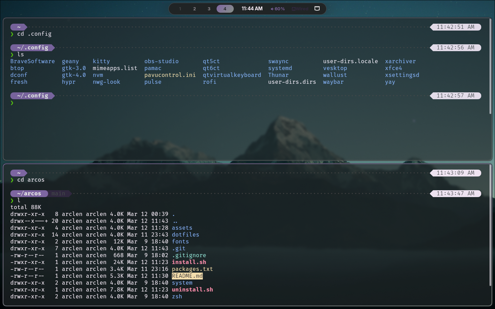
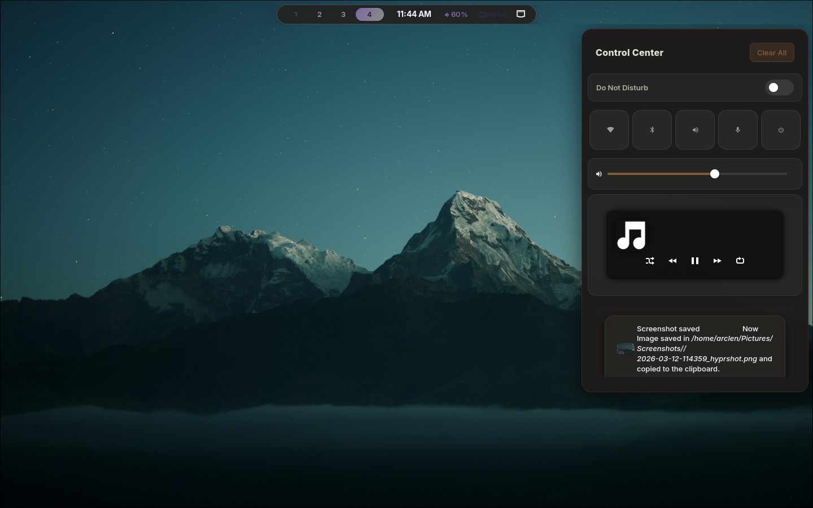
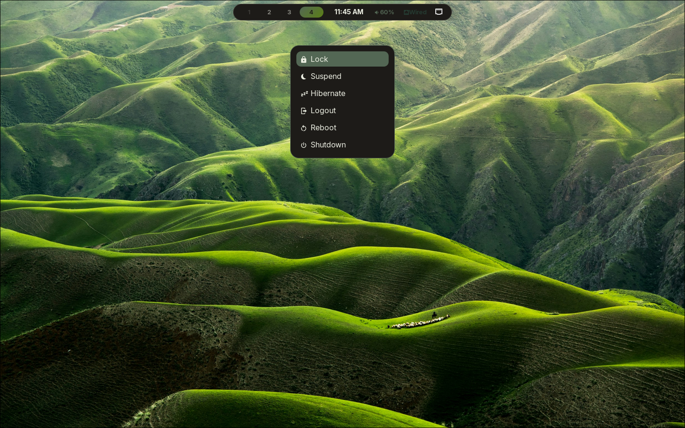
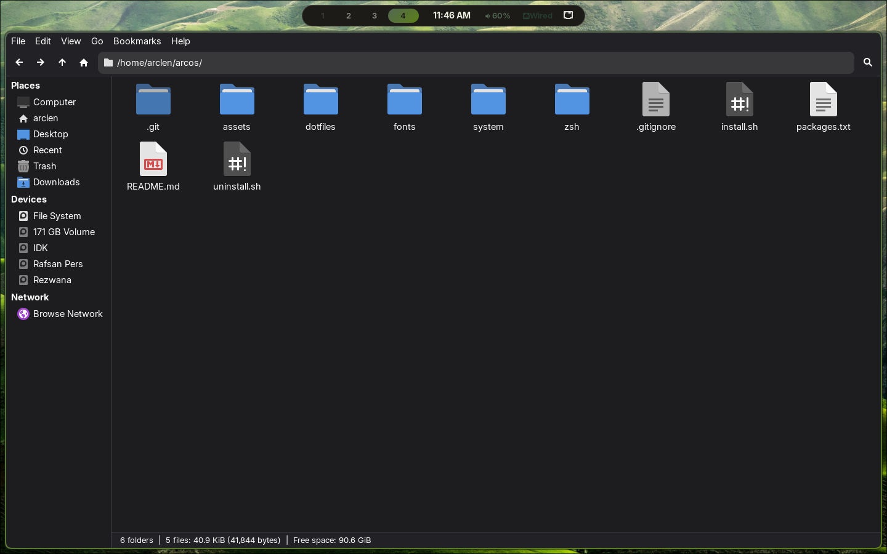

# ArcOS

A clean, minimal Hyprland rice for Arch Linux — built around a dynamic color system that adapts the entire desktop to your wallpaper. Every element — the bar, terminal, launcher, lock screen, and notifications — updates automatically when you change your wallpaper, giving you a cohesive look without any manual theming.

Comes with a fully automated installer that sets up everything from scratch: packages, AUR, shell, dotfiles, display manager, fonts, and services — with a single command.



---

## Gallery

| | |
|---|---|
|  |  |
| Desktop | App Launcher |
|  |  |
| Wallpaper Picker | Terminal |
|  |  |
| Notification Center | Power Menu |
|  |  |
| Lock Screen | File Manager |

---

## Stack

| Component | Package |
|---|---|
| Compositor | Hyprland |
| Bar | Waybar |
| Launcher | Rofi |
| Terminal | Kitty |
| Shell | Zsh + Oh My Zsh + Powerlevel10k |
| Notifications | swaync |
| Wallpaper | swww + wallust |
| Lock screen | Hyprlock |
| Display manager | SDDM (silent theme) |
| File manager | Thunar |
| Text editor | Geany + Fresh |
| Audio | PipeWire + pwvucontrol |
| Browser | Brave |
| Theme | adw-gtk3-dark |
| Icons | Papirus-Dark |
| Cursor | Bibata-Modern-Classic |
| Font (UI) | Inter |
| Font (terminal) | FiraCode Nerd Font |
| Font (clock) | Orbitron Bold |

---

## Install

> Works on a fresh Arch Linux install or an existing setup. Do **not** run as root.

```bash
git clone https://github.com/arclen-dev/arcos.git
cd arcos
chmod +x install.sh
./install.sh
```

The installer asks 4 questions (GPU type, laptop y/n, bluetooth y/n, username confirm), then runs fully unattended. Takes around 15–30 minutes depending on your connection.

**Reboot after install:**
```bash
sudo reboot
```

---

## Uninstall

```bash
chmod +x uninstall.sh
./uninstall.sh
```

Removes all ArcOS dotfiles, restores your previous config backup if one exists, optionally reverts your shell, and disables installed services.

---

## Keybinds

| Keys | Action |
|---|---|
| `Super + Enter` | Terminal |
| `Super + Space` | App launcher |
| `Super + E` | File manager |
| `Super + W` | Wallpaper picker |
| `Super + Shift + W` | Toggle dark/light mode |
| `Super + L` | Lock screen |
| `Super + X` | Power menu |
| `Super + N` | Notification center |
| `Super + Shift + N` | Toggle Do Not Disturb |
| `Super + V` | Clipboard history |
| `Super + .` | Emoji picker |
| `Super + Q` | Close window |
| `Super + arrows` | Move focus |
| `Super + Ctrl + arrows` | Navigate workspaces |
| `Super + 1–0` | Switch to workspace |
| `Super + Shift + 1–0` | Move window to workspace |
| `Print` | Screenshot (region) |
| `Shift + Print` | Screenshot (window) |
| `Super + Shift + Print` | Screenshot (fullscreen) |

---

## Wallpapers

Wallpapers are included in `assets/wallpapers/`. Change wallpaper anytime with `Super + W`.

Colors across the entire desktop — bar, terminal, lock screen, launcher, borders — update automatically via wallust every time you pick a new wallpaper.

---

## Structure

```
arcos/
├── install.sh          # Main installer
├── uninstall.sh        # Uninstaller / rollback
├── packages.txt        # All packages
├── dotfiles/           # ~/.config contents
│   ├── hypr/
│   ├── waybar/
│   ├── rofi/
│   ├── kitty/
│   ├── swaync/
│   ├── wallust/
│   ├── swayosd/
│   ├── btop/
│   ├── fresh/
│   ├── geany/
│   ├── gtk-3.0/
│   ├── gtk-4.0/
│   ├── nwg-look/
│   └── qt6ct/
├── fonts/              # Inter + FiraCode Nerd Font
├── zsh/
│   ├── .zshrc
│   └── .p10k.zsh
├── system/
│   ├── sddm.conf
│   └── 99-swappiness.conf
└── assets/
    ├── preview.png
    ├── gallery/
    └── wallpapers/
```

---

## Credits

- [Hyprland](https://hyprland.org)
- [wallust](https://codeberg.org/explosion-mental/wallust)
- [swww](https://github.com/LGFae/swww)
- [Powerlevel10k](https://github.com/romkatv/powerlevel10k)
- [sddm-silent-theme](https://github.com/uiriansan/SilentSDDM)
- [Inter font](https://rsms.me/inter)
